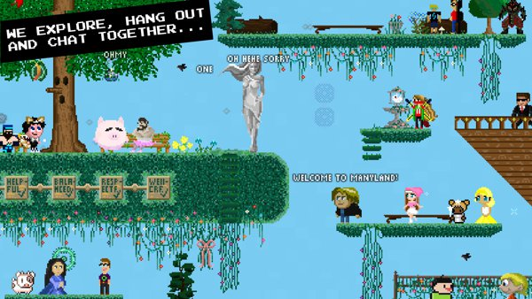
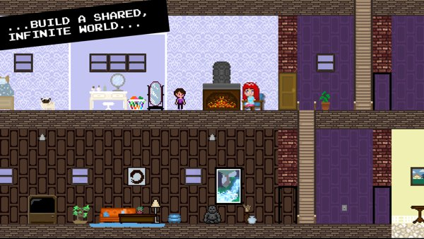
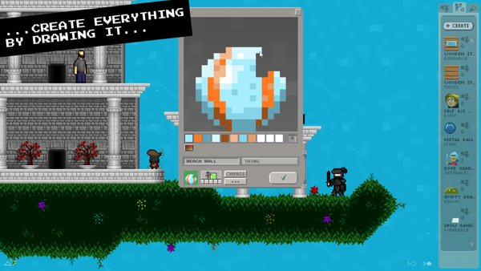
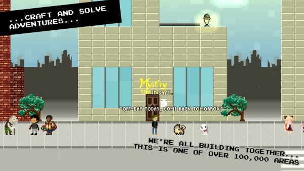
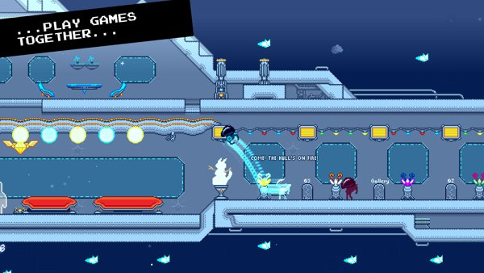
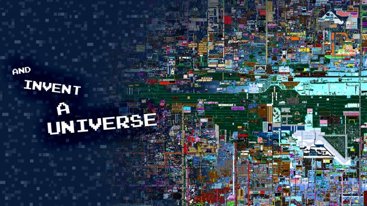

# Manyland

This is a set of classes of the 2d social sandbox universe <a href="http://manyland.com">Manyland</a>. The code relates to the Painter, Interactings, Dynamics, and Multis. It's part of a much bigger project, and sorry, some classes are in need of a split-up refactoring. Hope it's of use!

&nbsp;

&nbsp;

&nbsp;

&nbsp;

&nbsp;

&nbsp;

&nbsp;

&nbsp;

Manyland is co-developed with Scott Lowe, and shaped by all of you. Thanks for being in Manyland!

<a href="https://www.youtube.com/watch?v=k-kHTvzRLXQ">View Video</a> &nbsp;|&nbsp; <a href="http://findmanyland.com">More...</a>